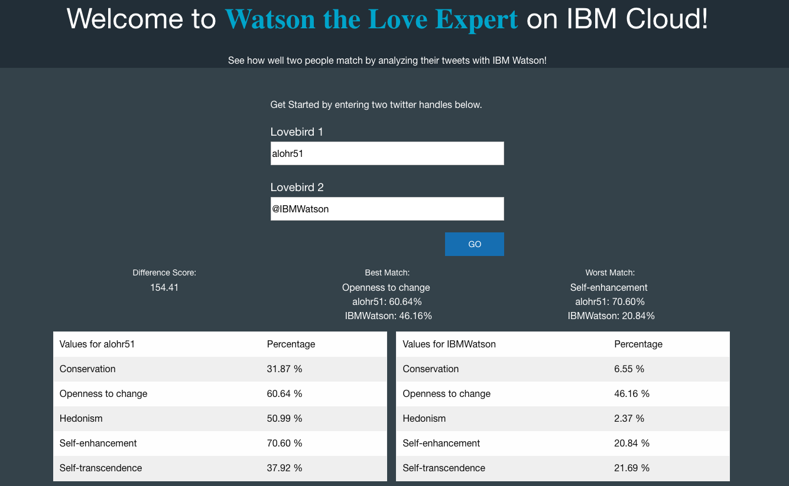

# Watson, The Love Expert!

## [Live Demo](https://watsonlove.mybluemix.net/)

## Deploy your own instance:

* Install the [cf cli](https://github.com/cloudfoundry/cli#downloads) if you do not already have it.

* Set an IBM Cloud api endpoint, for example: `cf api api.ng.bluemix.net`

* Log into the cf client using your IBM Cloud account credentials: `cf login`

* Create A Personality Insights Service
  * `cf create-service personality_insights "IBM Watson Personality Insights Monthly Plan" Personality-Insights-Watson-Love`

* Setup your Twitter user provided service.
  * If you do not have credentials, go get a [Twitter consumer key and secret.](https://apps.twitter.com/app/new)
  * From the Cloud Foundry CLI create your user-provided Twitter service
    * `cf cups twitter-service -p "apikey, secret"` this will start interactive input for your credentials. Enter your consumer API key and API key secret and hit enter.

* Clone this repository, `cd` into the new directory and push the app to your IBM Cloud org using `cf push`

